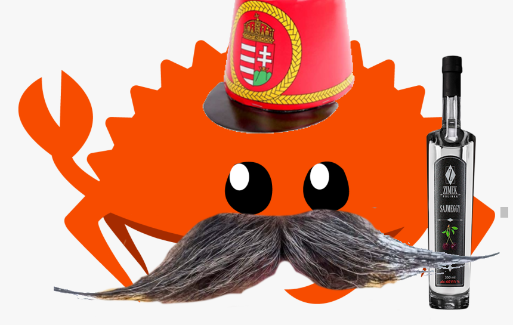

# rozsda



Aren't you _fáradt_ from writing Rust programs in English? Do you like saying
"kurva" a lot? Would you like to try something different, in an exotic and
funny-sounding language? Would you want to bring some French touch to your
programs?

**rozsda** (Hungarian for _Rust_) is here to save your day, as it allows you to
write Rust programs in Hungarian, using Hungarian keywords, Hungarian function names,
Hungarian idioms.

This has been designed to be used as the official programming language to
develop the future Hungarian sovereign operating system. 


Don't worry!
Hungarian Rust is fully compatible with English-Rust, so you can mix both at your
convenience.

Here's an example of what can be achieved with Rozsda:


```rust
rozsda::rozsda! {
    külső láda rozsda;

    használ std::collections::Szótár ahogy Könyv;

    tulajdonság KulcsÉrték {
        függvény ír(&magam, kulcs: Szöveg, érték: Szöveg);
        függvény olvas(&magam, kulcs: Szöveg) -> Eredmény<Opció<&Szöveg>, Szöveg>;
    }

    statikus mutálható SZÓTÁR: Opció<Könyv<Szöveg, Szöveg>> = Semmi;

    struktúra Beton;

    implementáció KulcsÉrték ciklus Beton { //kicsit fura elnevezés a fornak
        függvény ír(&magam, kulcs: Szöveg, érték: Szöveg) {
            legyen Könyv = veszélyes {
                SZÓTÁR.kap_vagy_beilleszt(Alapértelmezett::alapértelmezett)
            };
            Könyv.beilleszt(kulcs, érték);
        }
        függvény olvas(&magam, kulcs: Szöveg) -> Eredmény<Opció<&Szöveg>, Szöveg> {
            ha legyen Valami(Könyv) = veszélyes { SZÓTÁR.refként() } {
                Jó(Könyv.kap(&kulcs))
            } különben {
                Hibás("fetchez le Könyv".ebbe())
            }
        }
    }
}
```


### Other examples

See the [examples](pelda/src/main.rs) to get a rough sense of the whole
syntax. That's it.

## but why would you do zat

## Other languages

- Dutch: [roest](https://github.com/jeroenhd/roest)
- German: [rost](https://github.com/michidk/rost)
- Polish: [rdza](https://github.com/phaux/rdza)
- Italian: [ruggine](https://github.com/DamianX/ruggine)
- Russian: [Ржавый](https://github.com/Sanceilaks/rzhavchina)
- Esperanto: [rustteksto](https://github.com/dscottboggs/rustteksto)
- Hindi: [zung](https://github.com/rishit-khandelwal/zung)
- Other Hungarian (its a bit better I have to admit @jozsefsallai): [rozsda](https://github.com/jozsefsallai/rozsda)
- Chinese: [xiu (锈)](https://github.com/lucifer1004/xiu)
- Spanish: [rustico](https://github.com/UltiRequiem/rustico)
- Korean: [Nok (녹)](https://github.com/Alfex4936/nok)
- Finnish: [ruoste](https://github.com/vkoskiv/ruoste)
- Arabic: [sada](https://github.com/LAYGATOR/sada)
- Turkish: [pas](https://github.com/ekimb/pas)
- Vietnamese: [gỉ](https://github.com/Huy-Ngo/gir)
- Japanese: [sabi (錆)](https://github.com/yuk1ty/sabi)
- Danish: [rust?](https://github.com/LunaTheFoxgirl/rust-dk)
- Marathi: [gan̄ja](https://github.com/pranavgade20/ganja)
- Romanian: [rugină](https://github.com/aionescu/rugina)
- Czech: [rez](https://github.com/radekvit/rez)
- Ukrainian: [irzha](https://github.com/brokeyourbike/irzha)
- Bulgarian: [ryzhda](https://github.com/gavadinov/ryzhda)
- Slovak: [hrdza](https://github.com/TheMessik/hrdza)
- Catalan: [rovell](https://github.com/gborobio73/rovell)
- Corsican: [rughjina](https://github.com/aldebaranzbradaradjan/rughjina)
- Indonesian: [karat](https://github.com/annurdien/karat)
- Lithuanian: [rūdys](https://github.com/TruncatedDinosour/rudys)
- Greek: [skouriasmeno](https://github.com/devlocalhost/skouriasmeno)
- Thai: [sanim (สนิม)](https://github.com/korewaChino/sanim)
- Swiss: [roeschti](https://github.com/Georg-code/roeschti)
- Swedish: [rost](https://github.com/vojd/rost/)
- Croatian: [hrđa](https://github.com/njelich/hrdja)
- All of the above: [unirust](https://github.com/charyan/unirust)
